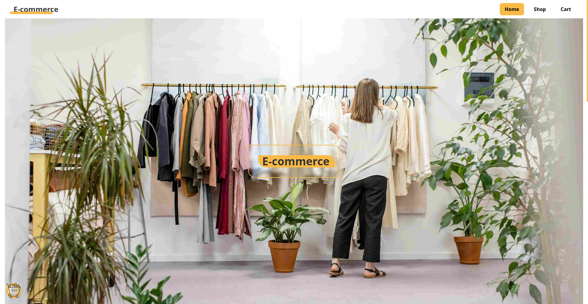
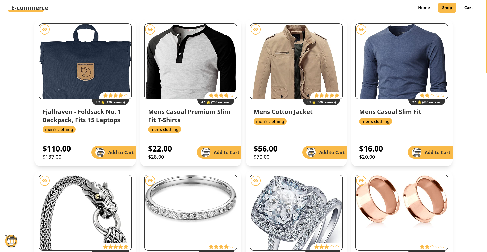
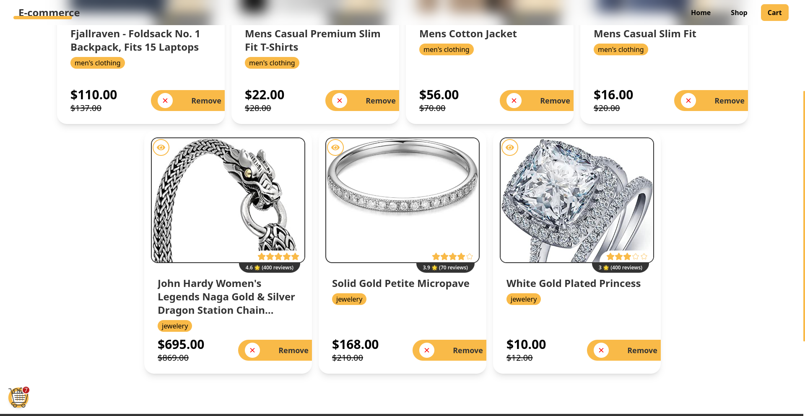
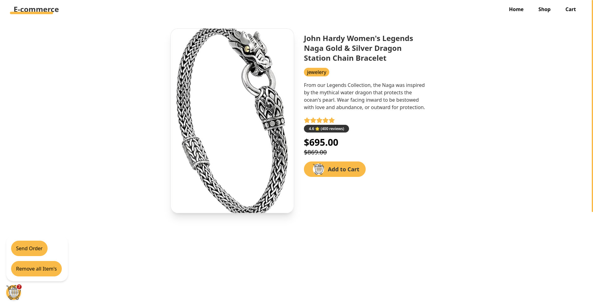

# E-Commerce Product Listing Page

This project is a simple e-commerce product listing page built using the Fake Store API. It showcases front-end skills by creating a clean, responsive, and user-friendly interface, with features like product browsing, a shopping cart, and individual product details.

## Objective

The goal is to fetch and display products from the Fake Store API, allowing users to browse, add items to a cart, and view detailed product information.

## Features

- **Fetch Products**: Retrieves a list of products from the Fake Store API.
- **Product Cards**: Each product is displayed in a card format, showcasing the image, title, price, and rating.
- **Cart Functionality**: Users can add products to a cart, view the cart, and modify item quantities.
- **Product Cards**: Each product is displayed in a card format that includes:
  - **Product Image**: A visually appealing image of the product.
  - **Title**: The product title displayed prominently.
  - **Price**: The current price, formatted as currency, along with a line-through for the original price.
  - **Rating**: A visual rating display with stars, showing the product's rating and the number of reviews.
  - **Category Tag**: A badge indicating the category of the product.
  - **Action Button**: A customizable button for user actions (e.g., adding to cart).
- **Context Management**: The cart state is managed using React Context for seamless data sharing across components.
- **Routing**: The app includes multiple pages using React Router, with routes for:
  - Home
  - Shop
  - Cart
  - Product Details (`/product/:id`)
- **Responsive Design**: The layout is fully responsive using CSS Grid/Flexbox for optimal viewing on various devices.
- **Loading Indicator**: Shows a loading spinner while fetching data.
- **Error Handling**: Displays a user-friendly error message if the data fetch fails.
- **Modals**: Implemented custom modal windows for user actions such as clearing the cart or sending an order.
- **BubbliesCart**: A fun cart icon that bubbles up and opens a modal for sending or clearing the cart.

## Pages Overview

- **Home Page**: Introduction to the store and featured products.
- **Shop Page**: Full product listing fetched from the API.
- **Cart Page**: Displays items added to the cart with the ability to modify quantities or remove items.
- **Product Details Page**: Detailed view of a specific product, accessed by clicking on a product card in the shop.
- **Page 404 ( not found page)**: to show error page when user try navigate wrong url

### Page Previews

- **Home Page**  
  

- **Shop Page**  
  

- **Cart Page**  
  

- **Product Details Page**  
  

- **Page 404**  
  

---

### Lighthouse Performance Audit

To ensure optimal performance, accessibility, and SEO of the application, a Lighthouse audit was conducted. The test results provide insights into various aspects of the application, highlighting areas of strength and potential improvement.

- **Test Overview**  
  

#### Key Metrics

- **Performance**: Measures how quickly the app loads and becomes interactive.
- **Accessibility**: Assesses the usability of the app for users with disabilities.
- **Best Practices**: Evaluates adherence to recommended web practices.
- **SEO**: Analyzes search engine optimization to improve visibility.

By following the recommendations from the Lighthouse audit, the application can be further enhanced for a better user experience.

---

## Tools & Frameworks

- **React**: Library used for building the user interface.
- **Tailwind CSS**: Utility-first CSS framework for fast styling and responsive design.
- **React Router**: For client-side routing and managing different pages.
- **SWC**: Used as the compiler for faster JavaScript and JSX compilation.
- **Vite**: Build tool used for running and bundling the project.
- **PropTypes**: A runtime type-checking tool used to ensure the correct type of props are passed to components, improving code reliability and maintainability.

## Project Structure

```
src/
├── components
│   ├── card
│   │   └── Card.jsx
│   ├── footer
│   │   └── Footer.jsx
│   ├── navbar
│   │   ├── Navbar.jsx
│   │   └── NavLinks.jsx
│   ├── sections
│   │   └── home
│   │       ├── ContentSection.jsx
│   │       └── HeroSection.jsx
│   └── UI
│       ├── BubbliesCart.jsx
│       ├── CardButton.jsx
│       ├── Error.jsx
│       ├── EyeShowButton.jsx
│       ├── FeatureCard.jsx
│       ├── Loading.jsx
│       ├── Logo.jsx
│       └── NavigationLink.jsx
├── context
│   └── CartContext.jsx
├── hooks
│   ├── useFetchProducts.jsx
│   └── useModal.jsx
├── index.css
├── main.jsx
└── routes
    ├── layout
    │   └── Root.jsx
    ├── pages
    │   ├── Cart.jsx
    │   ├── Index.jsx
    │   ├── Page404.jsx
    │   ├── Product.jsx
    │   └── Shop.jsx
    └── router.jsx
```

## Key Features Explained

### `useModal`

A custom hook for creating reusable modals. It accepts a message and a callback, allowing for confirmation modals with "Yes" or "No" options. The modal displays a customizable message and triggers the callback if the user confirms the action.

```js
const { ModalUI, setModalIsOpen } = useModal("Confirm action?", handleCallback);
```

### `useFetchProducts`

A custom hook that fetches a list of products from the Fake Store API. It manages loading, error, and successful data fetch states using a `useReducer` approach.

```js
const { products, loading, error } = useFetchProducts();
```

### `BubbliesCart`

A dynamic cart button with bubble-like behavior. It allows users to access cart actions (send or clear the cart) through modals. The cart button shows the number of items in the cart and triggers modals for clearing the cart or sending an order.

```js
<BubbliesCart />
```

### `Product Card Component`

The `Card` component is responsible for rendering product information, including:

- **Title**: Displays the product's name.
- **Price**: Shows the current price and the original price
- **Category**: Displays the product's category.
- **Image**: Shows the product's image with a hover effect that scales up the image.
- **Rating**: Displays the product rating using star icons. Full stars indicate the rating, while outlined stars indicate remaining capacity.
- **Rating Count**: Displays the number of reviews alongside the average rating.
- **Prop Types Validation**: The component uses PropTypes to ensure that the required properties are passed correctly, providing better error handling and code documentation.

## Installation

1. Clone the repository.
2. Navigate to the project directory.
3. Install dependencies using:

```bash
npm install
```

4. Start the development server:

```bash
npm run dev
```

5. Open your browser and go to `http://localhost:5173`.

## Challenges Faced

- **Cart Management**: Implementing a shared cart state across multiple components using React Context.
- **Modal Implementation**: Building a reusable modal hook (`useModal`) for confirmation dialogs across the app.
- **Routing**: Managing dynamic routes for individual product pages while maintaining a clean user experience.

## Live Demo

You can view the live demo of the project here: [Live Demo Link](https://e-commerce-elevate-task.netlify.app/)
